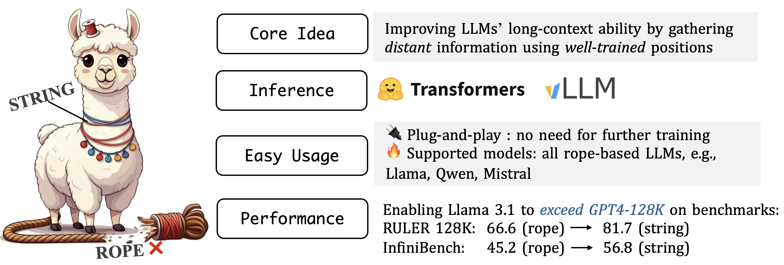
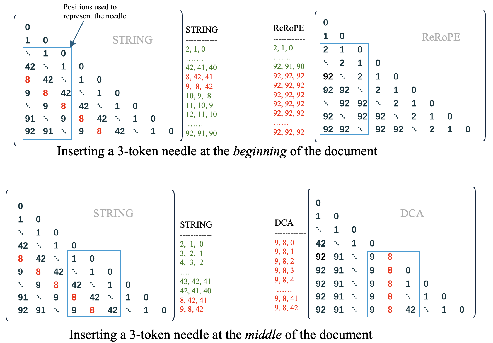

<p align="center" width="100%">

</p>

# Why Does the Effective Context Length of LLMs Fall Short?

We analyze the effective context length of LLMs from a pretraining perspective. Some interesting findings can be found in our [paper](https://arxiv.org/abs/2410.18745)
 (Sections 2 & 3). We observe there is a left-skewed position frequency distribution in LLM pretraining and these infrequent positions cannot effectively model long-range dependencies.
To reduce the gap between the training length and the effective length of current LLMs, we propose *STRING*, which shifts well-trained positions to overwrite the original ineffective positions during inference, enhancing performance within their existing training lengths. STRING is a training-free method that *does not require further training but brings significant improvements* to popular RoPE-based LLMs.

You can also use STRING to verify whether your LLMs have insufficient training for these large positions. This repo contains (1) code & data used in our experiments, (2) demos of deploying STRING with [Transformers](https://github.com/huggingface/transformers) and [VLLM](https://github.com/vllm-project/vllm) (3) Flash Attention implementation for baselines used in our paper.


### 🚀Quick Start
1. Inference with huggingface transformers🤗 (4.43.3) and Flash Attention
```python
### The transformers implementation has better readability ### 

import torch
from transformers import AutoTokenizer, AutoModelForCausalLM, AutoConfig
from string_for_llama import replace_with_string

model_path = "/path/to/your/model" # support llama, qwen, mistral
config = AutoConfig.from_pretrained(model_path)

# STRING
L = config.max_position_embeddings # 131072 for Llama 3.1
replace_with_string(max_test_length=L, shifted_offset=int(0.33 * L), small_local_value=128)  # shifted_offset also means how many positions are discarded
# we suggest setting `shifted_offset` to 0.25~0.4 * L and `small_local_value` to 128, 256, 512

tokenizer = AutoTokenizer.from_pretrained(model_path, trust_remote_code=True)
model = AutoModelForCausalLM.from_pretrained(model_path, attn_implementation="flash_attention_2", trust_remote_code=True, torch_dtype=torch.bfloat16, device_map="auto")
prompt = f"There is an important info hidden inside a lot of irrelevant text. Find it and memorize them. I will quiz you about the important information there.\n\nThe pass key is 123456. Remember it. 123456 is the pass key.\n " + \
    "The grass is green. The sky is blue. The sun is yellow. Here we go. There and back again. " * 4000 + \
    "\nWhat is the pass key?\nThe passkey is "
inputs = tokenizer(prompt, return_tensors="pt").to(model.device)
prompt_length = inputs["input_ids"].shape[1]
output = tokenizer.decode(model.generate(**inputs, max_new_tokens=128)[0][prompt_length:], skip_special_tokens=True)
print("[input length]: ",prompt_length)
print("[model output:]", output)

```

2. Inference with VLLM⚡️
```python
### The VLLM implementation supports (1) Continuous Batching, (2) PagedAttention, (3) Tensor parallel, and (4) Chunk prefilling ### 

# step1: Modify the config.json file for your model by adding:
{
    "architectures": [
        "LlamaForCausalLM"
    ],
    // ...
    "string_config": {
        "shifted_offset": 43253,  // 131072 * 0.33 
        "local_value": 128 
     }
}

# step2: VLLM inference
from vllm import LLM, SamplingParams

model_path = "/path/to/llama3-8b-instruct"  # We currently only support Llama
llm = LLM(model=model_path, tensor_parallel_size=1, enforce_eager=True, enable_chunked_prefill=False, max_num_batched_tokens=131072)

passkey_1  = "123456"
passkey_2  = "654321"
prompt1 = f"There is an important info hidden inside a lot of irrelevant text. Find it and memorize them. I will quiz you about the important information there.\n\nThe pass key is {passkey_1}. Remember it. {passkey_1} is the pass key.\n " + \
    "The grass is green. The sky is blue. The sun is yellow. Here we go. There and back again. " * 4000 + \
    "\nWhat is the pass key?\nThe passkey is " # The prompt is 100k long. You can try longer prompt by increasing the length.
prompt2 = prompt1.replace(passkey_1, passkey_2)
prompts = [f"{prompt1}", f"{prompt2}"]

# set temperature=0 if you want to use greedy decoding
sampling_params = SamplingParams(top_p=0.8, temperature=0.7, repetition_penalty=1.05, top_k=10, max_tokens=128)
outputs = llm.generate(prompts, sampling_params)

# Print the outputs.
for output in outputs:
    prompt = output.prompt
    generated_text = output.outputs[0].text
    print(f"Generated text: {generated_text!r}")
```
**running environment**
1. Requirements for Transformers+flash-attention2:
```bash
Transformers==4.43.3
torch >= 2.0.1
flash_attn >=2.5.3, <2.6.0
```
2. Requirements for VLLM
```bash
conda create -n vllm_string python=3.10  # we suggest creating a new environment to install vllm from source 
cd vllm_string & pip install -e . # after installation, we have torch==2.3.0, vllm==0.5.0.post1+cu124
```

### 💬Chat with PDFs
We present a demo to compare the performance of RoPE and STRING on Llama 3 by testing their ability to understand the lengthy [Llama 3 report](https://arxiv.org/pdf/2407.21783.pdf), which is approximately 100,000 tokens long.
```python
pip install PyMuPDF
wget https://arxiv.org/pdf/2407.21783.pdf
```
**Terminal deomo**: 
```bash
python chat_with_pdf.py --input 2407.21783.pdf --shifted_offset 43253
# rope:  python chat_with_pdf.py --input 2407.21783.pdf --shifted_offset 0
```

https://github.com/user-attachments/assets/5c84adb0-b611-4edc-a3ff-a64fe8165108

**Gradio deomo**: 
We also provide a gradio demo of using STRING to perform QA over a lengthy document: `gradio_demo.py`


#### STRING vs RoPE
The main difference between string and rope is the relative position matrix:
<p align="center" width="100%">

</p>


## 🔬Experiments 
This section contains the data and code for validating STRING in our paper.

#### Needle In A HayStack (4-needle)
We use NIAH (4-needle) to test our pretrained model, Tinyllama-1.3B. We also evaluate base models (without SFT) from the open-source community using STRING, RoPE, and extrapolation baselines on these tasks. The haystack consists of Paul Graham's essays, and the needles are 6-digit numbers. We report the accuracy of successfully retrieving at least two of the needles, following the Llama 3 report.
```python
cd niah
CUDA_VISIBLE_DEVICES=0 python test_niah_llama.py --test_max_length 131072 --model_path /path/to/llama --shifted_ratio 0.33 (default) --local_value 128 (default)
```

#### RULER
The test and evaluation code is from the official release of [RULER](https://github.com/hsiehjackson/RULER) which contains diverse sythetic tasks to test the long-context ability of LLMs. In this repo, we remove the engineering code from their offical code base but keep all config the same as them. We test Llama3.1 by setting the `max_length` in RULER to `128K`. 
```python
# step 1: generate the test data
cd ruler
python auto_prepare_data.py --model_path /path/to/model --max_length 131072 --temp llama3.1 (or qwen2)

# All tasks
[
    "niah_single_1", "niah_single_2", "niah_single_3",
    "niah_multikey_1", "niah_multikey_2", "niah_multikey_3",
    "niah_multivalue", "niah_multiquery", "vt", "cwe", "fwe", "qa_1", "qa_2"
]
```
This will generate the processed data for the 13 tasks in RULER and save it to the `data-jsonl` folder.

To test the model on RULER, run the following command:
```python
# step 2: test and evaluate the model
CUDA_VISIBLE_DEVICES=0 python test_ruler_llama.py --model_path /path/to/llama3 --task vt --data_dir data-jsonl/niah_multikey_3/llama3.1-8b-instruct-131072.jsonl  --shifted_ratio 0.33 (default) --local_value 128 (default)
# Qwen2: CUDA_VISIBLE_DEVICES=0 python test_ruler_qwen2.py --model_path /path/to/qwen2 --task vt --data_dir data-jsonl/niah_multikey_3/qwen2-72b-instruct-131072.jsonl --shifted_ratio 0.33 (default) --local_value 128 (default)
```
This command will generate a prediction file in the `Predictions/task_name/model_name/directory`. You can view your generation results and scores in this file and in your stdout. We release the predictions from Llama3.1-STRING 8B/70B [here](https://github.com/HKUNLP/STRING/tree/main/ruler/Predictions). You can also test string with the offical code from RULER by adding one line: `replace_with_string`.


#### InfiniteBench
We also test our method on [InfiniteBench](https://github.com/OpenBMB/InfiniteBench) which contains more practical long-context tasks.
```python
# step1: download the data
cd inifinite_bench/scripts
bash download_dataset.sh

# tasks
ALL_TASKS = [
    "passkey", "number_string", "kv_retrieval",
    "longdialogue_qa_eng", "longbook_sum_eng", "longbook_choice_eng",
    "longbook_qa_eng", "math_find", "math_calc",
    "code_run", "code_debug",
]
```
This will save the test samples to the `data` folder.

To test the model on InfiniteBench, run the following command:
```python
CUDA_VISIBLE_DEVICES=0 python src/test_infbench_llama.py --task kv_retrieval  --data_dir scripts/data --model_path /path/to/llama3.1 --model_name llama3.1 --shifted_ratio 0.33 (default) --local_value 128 (default)
```
This command will generate a prediction file in the `results-string/task_name/model_name/directory`. You can view your generation results and scores in this file and in your stdout.


**Detailed results on the 13 tasks from RULER 128K**
    
| Model              | single1 | single2 | single3 | multikey1 | multikey2 | multikey3 | multiquery | multivalue | vt   | cwe  | fwe  | qa_1 | qa_2 | avg  |
|--------------------|---------------|---------------|---------------|-----------------|-----------------|-----------------|------------|------------|------|------|------|------|------|------|
| Qwen2-72b-string   | 100           | 100           | 100           | 95.2            | 86.4            | 56.2            | 97.15      | 94.5       | 98.4 | 72.00| 95.5 | 54.5 | 50.0 | 84.6 |
| Llama3.1-70b-string| 100           | 100           | 100           | 97.2            | 71.4            | 81.2            | 99.6       | 96.6       | 93.2 | 10.58| 89.8 | 79.6 | 45.4 | 81.9 |
| Llama3.1-8b-string | 100           | 100           | 100           | 97.8            | 84.8            | 80.0            | 97.9       | 91.1       | 88.08| 0.0  | 75.13| 77.2 | 48.2 | 80.0 |


### FAQs
**Q:** Why does the relative position matrix for `shifted self-attention`  start with a `local_value of 128`?
**A:** LLMs heavily rely on the nearest `N` tokens to generate fluent content. If the `42K-th` slash is filled with `0`, the current token would associate itself with the `42K-th` token, which would significantly impact performance. By starting with 128, the model maintains a local context within a distance of 128, thereby preserving fluency. We suggest increasing 128 to **512** when obtaining unsatisfactory results.

**Q:** Why STRING can achieve superior performance compared with DCA and ReRoPE?
**A:** STRING can prevent positional disorder as much as possible. Let's illustrate with the needle-retrieval task. STRING can most likely preserve a continuous position list for the needle wherever it is placed.
<p align="center" width="100%">

</p>


### Acknowledgements
We sincerely appreciate the assistance provided by the following people (works):
- This pretraining part of work is built upon the [TinyLlama Project](https://github.com/jzhang38/TinyLlama). We thank [Peiyuan Zhang](https://github.com/jzhang38) and the TinyLlama team for their contributions.
- We would like to express our gratitude to the [Llama3](https://huggingface.co/meta-llama/) and [Qwen2](https://huggingface.co/collections/Qwen/) teams for providing the strong base models for this work.
- We thank [Yushi Bai](https://github.com/bys0318) for his help and valuable discussions.

### Citation
```
@misc{an2024doeseffectivecontextlength,
      title={Why Does the Effective Context Length of LLMs Fall Short?}, 
      author={Chenxin An and Jun Zhang and Ming Zhong and Lei Li and Shansan Gong and Yao Luo and Jingjing Xu and Lingpeng Kong},
      year={2024},
      eprint={2410.18745},
      archivePrefix={arXiv},
      primaryClass={cs.CL},
      url={https://arxiv.org/abs/2410.18745}, 
}
```
